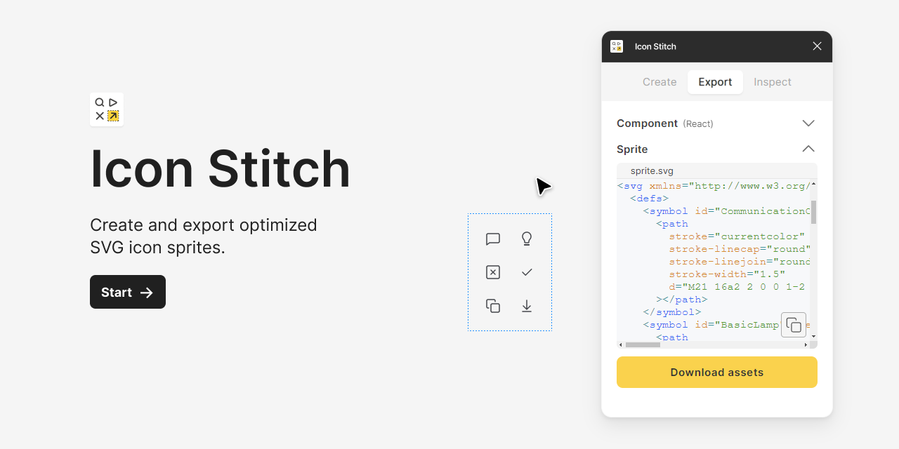

# Figma plugin Icon Stitch Issue Tracker

**DISCLAIMER**: Plugin is currently in pre-publishing process and is not yet available on the Figma Community site. Please check back later for updates.

---

This is the issue tracker for the Figma plugin **Icon Stitch**. If you have any problems or feature requests, please open an issue here.

For more information on how to use this plugin, please visit the [plugin's page on the Figma Community site](https://www.figma.com/community/plugin/1400822365818340250/icon-stitch).

## Issues

Please open an issue if you have any problems or feature requests. You can also use the [Discussions](https://github.com/thevisioner/figma-plugin-icon-stitch-issue-tracker/discussions) tab to ask questions or share ideas.

Please check the [existing issues](https://github.com/thevisioner/figma-plugin-icon-stitch-issue-tracker/issues) before opening a new one. If you find an issue that is similar to yours, please add a comment to that issue instead of opening a new one.

Please note that issues will be closed if they are not related to the plugin or if they are duplicates of existing issues.

## Reporting an issue

When reporting an issue, please include the following information:

- **Description**: A clear and concise description of the issue.

- **Steps to reproduce**: Detailed steps to reproduce the issue.

- **Expected behavior**: A clear and concise description of what you expected to happen.

- **Actual behavior**: A clear and concise description of what actually happened.

- **Screenshots**: If applicable, add screenshots to help explain the issue.

- **Additional context**: Add any other context about the problem here.

## Feature requests

Please consider supporting the plugin by upgrading to the **Paid version** if you find it useful. Any feature requests will be considered for the Paid version only.

If you have a feature request, please include the following information:

- **Description**: A clear and concise description of the feature request.

- **Use case**: A description of how the feature would be used.

- **Additional context**: Add any other context or screenshots about the feature request here.

## Changelog

Please see the [CHANGELOG.md](./CHANGELOG.md) file for details on the latest updates to the plugin.

## Support

If you have any questions or need help with the plugin, please contact [plugin author](mailto:raimonds.sarkanbardis@gmail.com?subject=A%20Question%2FHelp%20with%20Figma%20plugin%20Icon%20Stitch&body=Hello%2C%0A%0AI%20have%20a%20question%20about%20the%20Figma%20plugin%20Icon%20Stitch.%0A%0A%23%23%20Description%0A%5BPlease%20enter%20a%20clear%20and%20concise%20description%20of%20your%20question%20or%20issue%20here.%5D%0A%0A%23%23%20Additional%20Context%0A%5BPlease%20add%20any%20other%20context%20or%20information%20related%20to%20your%20question%20or%20issue%20here.%5D%0A%0AThank%20you%2C%0A%5BYour%20Name%5D) by email.

## About

This project is created and maintained by [Raimonds Sarkanbardis](https://www.visioner.dev) / [@thevisioner](https://www.figma.com/@thevisioner).

Thank you for using the Figma plugin **Icon Stitch**!

## Terms of Service

By using the **Icon Stitch** plugin, you agree to the following terms:

- The plugin is provided "as is" without warranty of any kind.

- You may not use the plugin to create any content that is illegal or unethical.

- You may use the plugin for personal or commercial projects.

- You may not resell or redistribute the plugin.

## License

This project is licensed under the MIT License - see the [LICENSE.md](./LICENSE.md) file for details.
